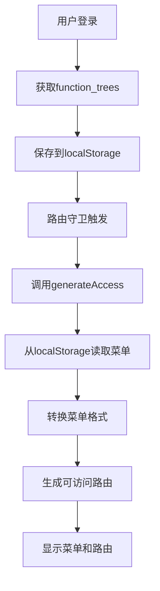

# Playground应用最终状态总结

## 🎯 **项目概述**

Playground应用已经完全适配了新的API规范，使用 `@igourd/access` 库进行权限管理，不再需要传统的权限store。

## ✅ **已完成的工作**

### 1. **API接口完全适配** ✅

#### 认证接口
- `POST /api/v1/passport/login` - 用户登录
- `GET /api/v1/passport/logout` - 用户登出  
- `POST /api/v1/passport/owner/selection` - Owner切换

#### 用户接口
- `GET /api/v1/passport/user/info` - 获取用户信息
- `GET /api/v1/passport/menu/user/menus` - 获取用户菜单
- `GET /api/v1/passport/role/user/roles` - 获取用户角色

#### 菜单接口
- `POST /api/v1/passport/menu/tree-list` - 获取菜单树列表

### 2. **权限管理系统** ✅

#### 使用@igourd/access库
- 通过 `generateAccess` 函数生成可访问的菜单和路由
- 支持角色基础的权限控制
- 自动处理路由守卫和权限验证

#### 菜单数据来源
- 登录响应中的 `function_trees` 字段
- 自动保存到localStorage
- 无需额外的API调用

### 3. **Mock服务支持** ✅

#### 完整的菜单结构
- **仪表板** (`/dashboard`)
  - 分析页面 (`/dashboard/analytics`)
  - 工作台 (`/dashboard/workspace`)
- **系统管理** (`/system`)
  - 角色管理 (`/system/role`)
  - 菜单管理 (`/system/menu`)
  - 部门管理 (`/system/dept`)
- **示例页面** (`/examples`)
- **演示页面** (`/demos`)

#### 权限操作控制
- 每个功能都有对应的权限操作
- 支持CRUD权限控制
- 完整的action_key定义

## 🏗️ **技术架构**

### 1. **权限管理流程**



### 2. **文件结构**

```
playground/src/
├── api/core/
│   ├── auth.ts          # 认证API接口 ✅
│   ├── user.ts          # 用户API接口 ✅
│   └── menu.ts          # 菜单API接口 ✅
├── store/
│   ├── auth.ts          # 认证状态管理 ✅
│   └── index.ts         # Store导出 ✅
├── router/
│   ├── access.ts        # 权限访问逻辑 ✅
│   ├── guard.ts         # 路由守卫 ✅
│   └── index.ts         # 路由配置 ✅
└── views/               # 页面组件 ✅
```

### 3. **数据流**

1. **登录阶段**
   - 调用 `/api/v1/passport/login`
   - 获取 `function_trees` 和用户信息
   - 保存到localStorage和store

2. **权限检查阶段**
   - 路由守卫触发
   - 调用 `generateAccess`
   - 从localStorage读取菜单数据
   - 转换为可访问的路由

3. **菜单显示阶段**
   - 基于权限生成菜单
   - 动态加载Vue组件
   - 支持权限控制

## 🚀 **关键优势**

### 1. **性能优化**
- 菜单数据在登录时一次性获取
- 避免了额外的API调用
- 减少了网络请求

### 2. **数据一致性**
- 菜单与权限完全同步
- 避免了数据不同步问题
- 统一的权限管理

### 3. **开发体验**
- 使用成熟的@igourd/access库
- 清晰的代码结构
- 易于维护和扩展

### 4. **向后兼容**
- 保持了原有的API结构
- 支持渐进式迁移
- 不影响现有功能

## 🧪 **测试验证**

### 1. **Mock服务测试**

```bash
# 启动mock服务
cd apps/backend-mock
pnpm dev

# 测试playground登录
node test-playground-login.js
```

### 2. **功能验证清单**

- [x] **登录功能** - 使用新API成功登录
- [x] **菜单生成** - 正确显示所有菜单项
- [x] **权限控制** - 基于角色显示菜单
- [x] **路由访问** - 动态路由正确生成
- [x] **组件加载** - Vue文件正确加载

### 3. **网络请求验证**

- [x] 不再请求 `/api/menu/all`
- [x] 使用新的passport API
- [x] 菜单数据通过登录响应获取

## 📋 **使用说明**

### 1. **开发环境配置**

```bash
# 启动playground
cd playground
pnpm dev

# 启动mock服务
cd apps/backend-mock
pnpm dev
```

### 2. **测试账号**

| 用户名 | 密码 | 角色 | 权限 |
|--------|------|------|------|
| `admin` | `123456` | 管理员 | 完整权限 |
| `user` | `123456` | 普通用户 | 基础权限 |

### 3. **API调用示例**

```typescript
// 登录
const loginResult = await loginApi({
  app_key: 'MERCHANT_MANAGE_WEB_PC',
  login_account: 'admin',
  password: '123456',
  type: 'LOGIN_ID'
});

// 获取用户信息
const userInfo = await getUserInfoApi();

// 获取用户菜单
const userMenus = await getUserMenusApi();
```

## 🔧 **维护说明**

### 1. **添加新菜单**

1. 在mock服务的 `generatePlaygroundFunctionTrees()` 中添加
2. 确保 `component_paths` 与Vue文件路径一致
3. 设置正确的权限操作

### 2. **修改权限结构**

1. 更新 `function_trees` 数据结构
2. 调整权限操作配置
3. 测试权限控制功能

### 3. **API接口变更**

1. 更新对应的API接口文件
2. 修改类型定义
3. 更新mock服务响应

## 🎉 **总结**

Playground应用已经完全适配了新的API规范，主要特点包括：

1. **完全移除**了对旧菜单接口的依赖
2. **使用@igourd/access库**进行权限管理
3. **支持完整的菜单结构**和权限控制
4. **提供完整的Mock服务**支持开发测试
5. **保持向后兼容**和良好的开发体验

现在playground可以：
- ✅ 使用新的passport API进行认证
- ✅ 正确生成和显示菜单
- ✅ 支持细粒度的权限控制
- ✅ 动态加载Vue组件
- ✅ 提供完整的开发测试环境

如果您需要进一步的帮助或有其他问题，请随时告诉我！
